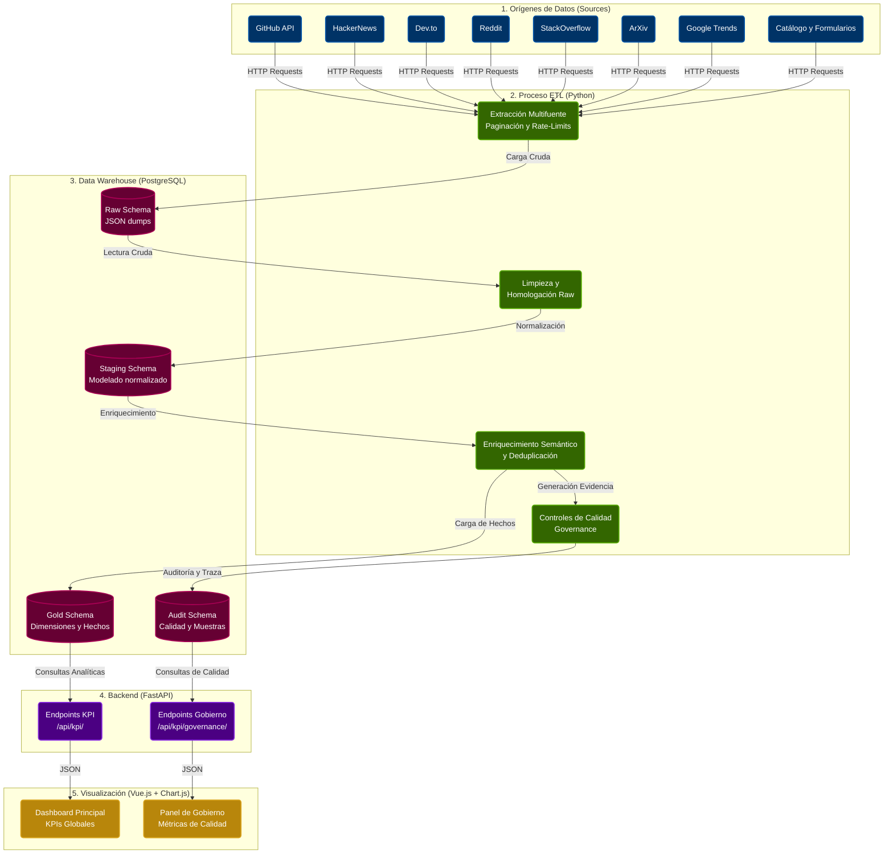

# Observatorio de Adopción de Agentes de IA - Arquitectura

Esta figura detalla el flujo de datos del observatorio, desde la extracción paralela hasta su visualización en el dashboard.

## Flujo del Pipeline
1. **Extracción (Raw):** El ETL conecta simultáneamente con múltiples APIs. Los resultados se guardan en crudo para asegurar trazabilidad.
2. **Transformación (Staging):** Los datos crudos se unifican bajo un esquema común, se mapean las entidades (agentes) y se detectan nulos.
3. **Carga Analítica (Gold):** Creación del modelo en estrella (star-schema) para potenciar la rapidez de lectura en el dashboard.
4. **Gobierno (Audit):** A lo largo del pipeline se generan métricas de reconciliación y calidad que se envían directamente a `audit`.
